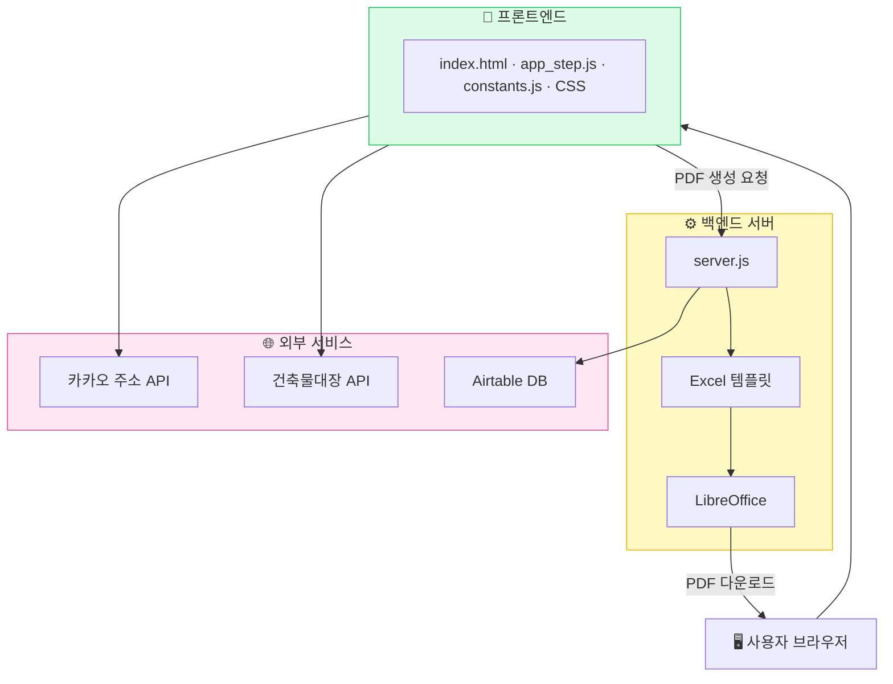

# 전체 시스템 구조도
> 이 시스템이 어떤 부품들로 이루어져 있는가

---

| 구성 요소 | 역할 |
|----------|------|
| 프론트엔드 | 화면 구성 + 계산 로직 |
| 백엔드 서버 | PDF 생성 + DB 저장 중개 |
| 카카오 API | 주소 검색 |
| 건축물대장 API | 연면적·용도 자동 조회 |
| Airtable | 고객·견적 데이터 저장 |
