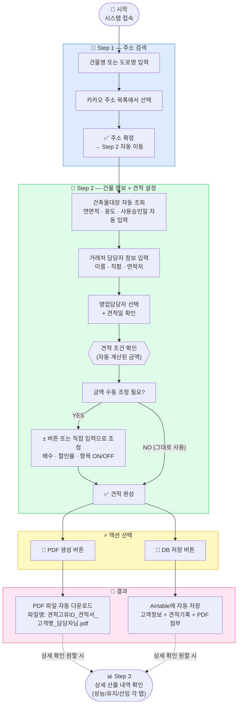

# 사용자 업무 흐름도

> 담당자가 실제로 이 시스템을 어떻게 사용하는가

---

## 소요 시간 비교

| 단계 | 자동화 전 | 자동화 후 |
|------|----------|----------|
| 건물 정보 입력 | 인터넷 검색 후 수기 입력 (5~10분) | 주소 선택 → 자동 입력 (30초) |
| 금액 계산 | 엑셀 수식 직접 작성 (10~20분) | 연면적 입력 → 자동 계산 (즉시) |
| PDF 저장 | 엑셀 → PDF 변환 → 파일명 정리 (5분) | 버튼 1번 (10초) |
| DB 저장 | 별도 시트에 수기 입력 (5분) | 버튼 1번 (자동) |
| **총 소요시간** | **약 30~40분** | **약 2~3분** |
