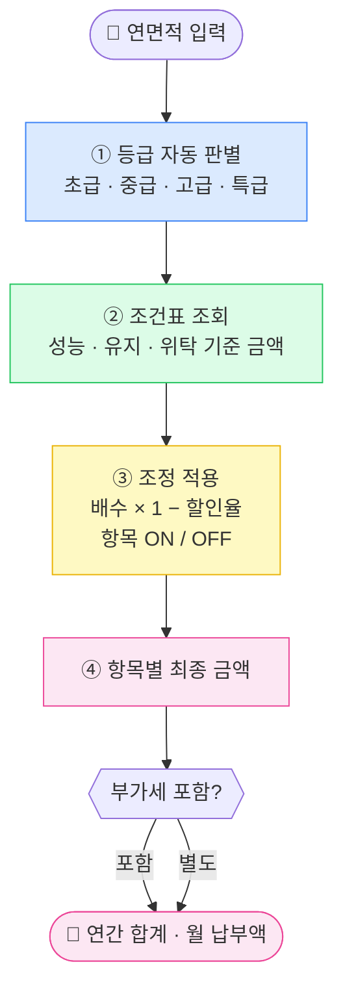

# 견적 계산 로직 흐름
> 금액은 어떻게 자동으로 계산되는가

---

## ① 등급 판별 기준

| 연면적 | 등급 |
|--------|------|
| 5,000 ~ 15,000 ㎡ | 초급 |
| 15,000 ~ 30,000 ㎡ | 중급 |
| 30,000 ~ 60,000 ㎡ | 고급 |
| 60,000 ㎡ 이상 | 특급 |

---

## ② 조건표 기준값

| 연면적 구간 | 등급 | 성능점검(연) | 유지점검(연) | 위탁선임(월) | 투입인원 |
|-----------|------|------------|------------|------------|---------|
| 5,000 ~ 10,000 ㎡ | 초급 | 1,080,000 | 360,000 | 80,000 | 4명 |
| 10,000 ~ 15,000 ㎡ | 초급 | 1,335,000 | 405,000 | 80,000 | 4명 |
| 15,000 ~ 30,000 ㎡ | 중급 | 990,000 | 450,000 | 130,000 | 6명 |
| 30,000 ~ 60,000 ㎡ | 고급 | 1,770,000 | 630,000 | 150,000 | 8명 |
| 60,000 ㎡ 이상 | 특급 | 2,430,000 | 810,000 | 180,000 | 10명 |

> 기준값 수정: `public/constants.js`
