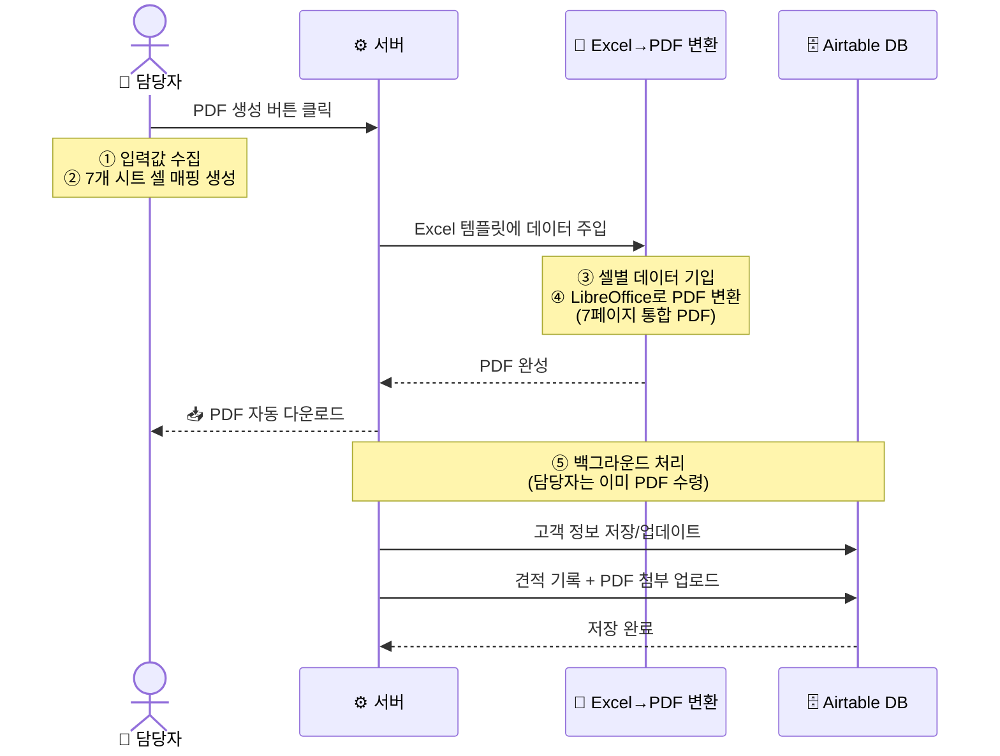
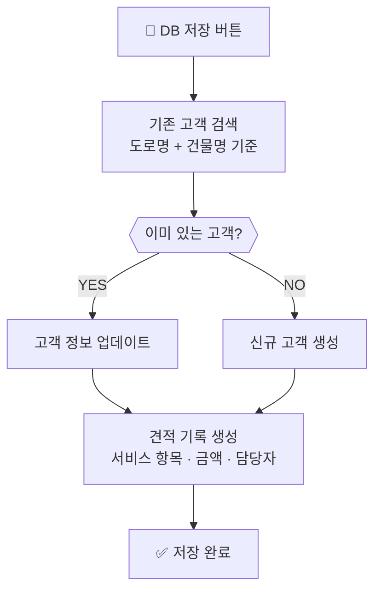

# PDF 생성 & DB 저장 흐름

> "PDF 생성" 버튼 한 번을 누르면 뒤에서 무슨 일이 일어나는가

---

## 핵심 포인트

| 항목 | 설명 |
|------|------|
| **버튼 클릭 후 체감 시간** | 약 5~10초 (LibreOffice 변환 시간) |
| **생성되는 PDF 페이지** | 7페이지 (표지 + 견적서 + 성능/유지/선임 산출내역 + 수량내역) |
| **Airtable 저장 방식** | PDF 다운로드 완료 후 백그라운드에서 자동 처리 (담당자 대기 불필요) |
| **중복 고객 처리** | 동일 건물명+주소가 이미 DB에 있으면 정보를 업데이트 (중복 생성 안 함) |

---

## DB 저장 버튼만 눌렀을 때

