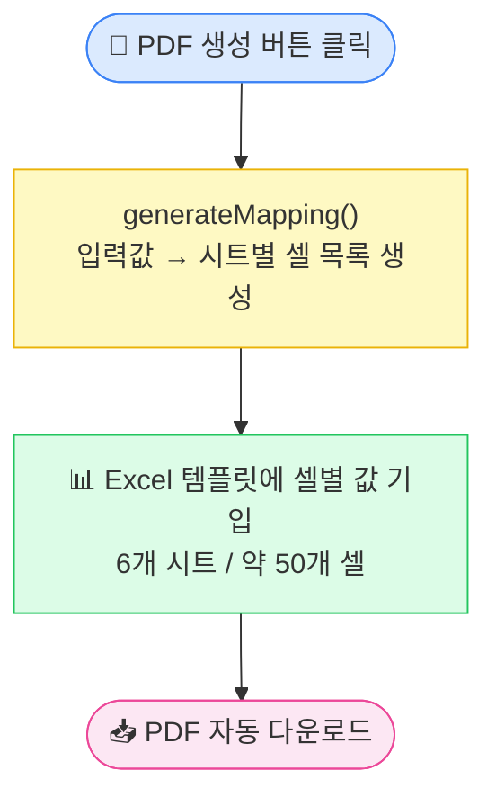
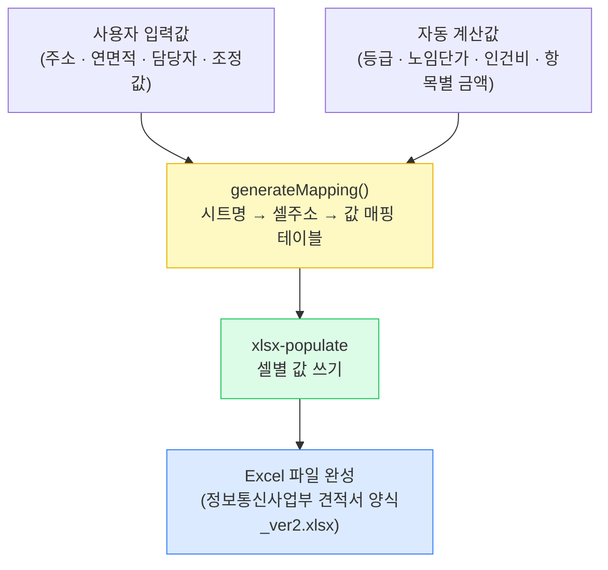

# Excel 셀 매핑 구조도
> PDF 생성 버튼을 누르면 어떤 데이터가 Excel 어느 셀에 들어가는가

---

## 시트별 셀 매핑 상세

### 📋 표지

| 셀 | 데이터 |
|----|--------|
| A10 | 고객명 (`고객명 : ○○○` 형식) |
| A18 | 견적일 (한국어 형식: 2026년 3월 24일) |

---

### 📄 1. 견적서

| 셀 | 데이터 |
|----|--------|
| E8 | 견적일 |
| E9 | 고객명 |
| G22 | 부가세 여부 `(VAT 포함)` / `(VAT 별도)` |
| Q12 | 영업 담당자 이름 |
| X13 | 영업 담당자 연락처 |
| J16 | 주소 |
| J17 | 사용승인일 |
| J18 | 주용도 |
| W18 | 연면적 |
| J19 | 거래처 담당자 이름 |
| W19 | 거래처 담당자 연락처 |
| J20 | 서비스 항목 텍스트 |
| P24 / P25 / P26 | 성능 · 유지 · 위탁 수량 (ON=1 / OFF=0) |
| T24 | 성능점검비 (조정 금액) |
| T25 | 유지점검비 (조정 금액) |
| T26 | 위탁선임비 (조정 금액) |
| T27 | 합계 (T24+T25+T26) |
| T28 | 최종 연간 금액 (부가세 반영) |
| T29 | 월 납부액 (연간 ÷ 12) |
| T31 | 부가세 금액 |
| Y26 | 건물 등급 (초급/중급/고급/특급) |

---

### 🔍 2.1 성능점검 산출내역 · 🔧 2.2 유지점검 산출내역

> 두 시트는 동일한 셀 구조 사용

| 셀 | 데이터 |
|----|--------|
| E6 ~ E9 | 등급별 투입인원 수 (특급/고급/중급/초급 순) |
| G6 ~ G9 | 등급별 노임단가 |
| H10 | 직접인건비 합계 |
| H11 | 직접경비 |
| H12 | 제경비 |
| H13 | 기술료 |
| H14 | 산출 합계 |
| H15 | 조정 금액 (목표금액 − 산출합계) |
| H17 | 최종 합계 (목표금액) |
| O6 | 총 투입인력 수 |

---

### 👤 2.3 선임 산출내역

> 성능/유지와 달리 선임은 **월 단가 × 12개월** 구조

| 셀 | 데이터 |
|----|--------|
| E6 ~ E9 | 등급별 투입인원 (1명만 해당 등급에 기입) |
| G6 ~ G9 | 등급별 노임단가 |
| H10 | 연간 인건비 (노임단가 × 12개월) |
| H11 ~ H13 | 직접경비 · 제경비 · 기술료 (모두 0) |
| H14 | 산출 합계 |
| H15 | 조정 금액 |
| H17 | 최종 합계 |
| O6 | 투입인력 (0 또는 1) |

---

### 📊 4. 성능점검 수량내역

| 셀 | 데이터 |
|----|--------|
| F4 | 조정계수 |

---

## 데이터 흐름 요약

